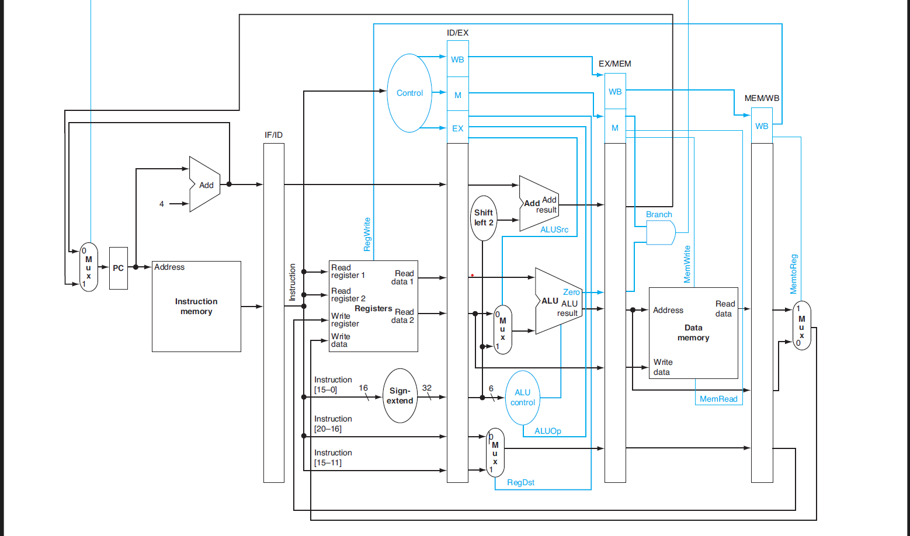

# CPU Pipeline with Memory Cache Simulation (Verilog)

## Overview

This project simulates a **pipelined CPU** with an integrated **memory cache** using **Verilog**. The design is based on a **five-stage pipeline architecture** and includes instruction fetch, decode, execute, memory access, and write-back stages. A **cache memory** module is implemented to optimize memory access performance.

## Pipeline Architecture

The pipeline follows a standard five-stage design:

- **Instruction Fetch (IF)**: Fetches instructions from instruction memory.
- **Instruction Decode (ID)**: Decodes the fetched instruction and reads registers.
- **Execute (EX)**: Performs arithmetic and logic operations using the ALU.
- **Memory Access (MEM)**: Reads from or writes to data memory.
- **Write Back (WB)**: Writes the result back to the register file.

### Pipeline Diagram

Below is the pipeline datapath used in this project:

